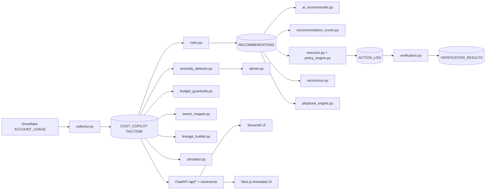

# Snowflake Cost Copilot

Enterprise-grade FinOps copilot for Snowflake that detects cost waste, explains root causes, recommends fixes, and supports governed remediation with verification.

This project combines:
- telemetry ingestion from Snowflake system views,
- rule-based + AI-grounded recommendations,
- anomaly and budget guardrails,
- policy-gated execution (`DRY_RUN` / `APPLY`),
- post-change verification and recurrence memory,
- chat API + Streamlit fallback UI,
- cinematic Next.js animated control center UI.

---

## Why This Product Exists

Snowflake gives excellent warehouse-level observability, but teams still struggle with:
- unclear ownership of spend,
- delayed diagnosis of spikes,
- recommendation fatigue without actionability,
- unsafe automation risk,
- no closed-loop proof of realized savings.

**Snowflake Cost Copilot** addresses these with an end-to-end lifecycle:
1. Detect issues quickly.
2. Explain likely causes with evidence.
3. Recommend ranked fixes.
4. Apply safe low-risk changes (with approvals).
5. Verify whether outcomes improved.
6. Learn recurrence patterns for smarter prioritization.

---

## Business Value / Cost Savings Model

Typical cost leakage sources this copilot targets:
- spill / memory pressure,
- full scans and weak pruning,
- queue congestion and concurrency contention,
- idle warehouse burn,
- ingestion noise (small files, failures),
- budget overrun by unowned or mis-tagged workloads.

Expected value levers:
- **5–20%** credit reduction on chronic workloads via pruning/spill/idle tuning.
- Faster incident triage through owner mapping and anomaly stream.
- Lower operational risk with policy-gated applies and rollback logging.
- Better governance with budget breaches and verified action outcomes.

Track ROI using:
- estimated vs realized savings,
- recurrence rate,
- time-to-detect/time-to-fix,
- verified-effective action ratio.

---

## How It Compares (Cortex / Espresso-style copilots)

This project is not a generic LLM assistant. It is a **Snowflake-specialized FinOps control plane**.

### Where it is stronger
- **Evidence-first recommendations** tied to Snowflake telemetry and concrete query IDs.
- **Governed execution path** (approval + allowlist + rollback + policy checks).
- **Closed-loop verification** (`VERIFIED_EFFECTIVE`, `REGRESSED`, etc.).
- **Budget + anomaly + recurrence intelligence** in one system.
- **Action simulation** before change rollout.
- **Ownership mapping** from query tags to teams.

### Where generic copilots are still useful
- ad-hoc exploratory Q&A,
- broad ideation,
- non-domain-specific assistance.

Use both together: generic copilots for brainstorming, Cost Copilot for accountable FinOps operations.

---

## Core Capabilities

- **Ingestion:** `ACCOUNT_USAGE` + helper rollups into `COST_COPILOT` schema.
- **Rules engine:** heavy jobs, spill, pruning, queue, compile overhead, idle burn, ingest waste.
- **AI recommender:** OpenRouter by default with template fallback if unavailable.
- **Anomaly detector:** rolling baseline scoring for cost/perf spikes.
- **Budget guardrails:** warning/critical breach events + burn-rate tracking.
- **Owner intelligence:** query-tag parsing + owner mapping tables.
- **Lineage graph edges:** query/tag/user/role/warehouse graph model.
- **Simulator:** what-if scenarios for estimated runtime/cost delta.
- **Policy engine:** safe execution controls and optional two-person approval.
- **Verification loop:** pre/post comparisons and recommendation status updates.
- **Recurrence memory:** chronic offender tracking and prioritization.
- **APIs + WS:** `/api/*` and `/ws/events` for real-time UX.
- **UIs:** Streamlit fallback + Next.js animated command center.

---

## Architecture



---

## Step-by-Step: Run the Application

### 0) Go to project root

```bash
cd /Users/ankurchopra/repo_projects/snowflake-cost-copilot
```

### 1) Install dependencies

```bash
python -m pip install -r requirements.txt
```

### 2) Configure environment

Use `.env` (or copy from `env.example`) and set:
- `SNOWFLAKE_ACCOUNT`
- `SNOWFLAKE_USER`
- auth mode:
  - password mode: `SNOWFLAKE_AUTHENTICATOR=Snowflake` + `SNOWFLAKE_PASSWORD=...`
  - browser mode: `SNOWFLAKE_AUTHENTICATOR=ExternalBrowser` + empty password
- `SNOWFLAKE_ROLE`
- `SNOWFLAKE_WAREHOUSE`
- `SNOWFLAKE_DATABASE`
- `OPENROUTER_API_KEY` (optional but recommended)

Load env:

```bash
set -a; source .env; set +a
```

### 3) Provision lab infra + seed synthetic workload

```bash
./scripts/setup_lab.sh
```

This provisions schemas/tables/warehouse + seeds 10M+ row synthetic data and runs workload queries.

### 4) Run copilot pipeline

```bash
python python/run_copilot.py --days 7 --mode DRY_RUN --ai on --verify on
```

Expected console sections:
- top heavy tags,
- recommendations,
- AI recommendations,
- anomalies,
- sample SQL snippets.

### 5) Start backend API

```bash
python -m uvicorn python.chat_api:app --reload --port 8000
```

Health check:

```bash
curl http://127.0.0.1:8000/health
```

### 6) Start UI options

#### Option A: Streamlit fallback

```bash
streamlit run ui/app.py
```

#### Option B: Premium animated UI

```bash
cd web
npm install
npm run dev
```

Open: `http://localhost:3000`

### 7) Validate outputs in Snowflake

```sql
SELECT * FROM COST_COPILOT.RECOMMENDATIONS ORDER BY created_at DESC LIMIT 20;
SELECT * FROM COST_COPILOT.AI_RECOMMENDATIONS ORDER BY created_at DESC LIMIT 20;
SELECT * FROM COST_COPILOT.ANOMALIES ORDER BY detected_at DESC LIMIT 20;
SELECT * FROM COST_COPILOT.BUDGET_EVENTS ORDER BY created_at DESC LIMIT 20;
SELECT * FROM COST_COPILOT.V_ACTION_EFFECTIVENESS ORDER BY action_time DESC LIMIT 20;
```

---

## API Reference

- `POST /chat` (legacy-compatible)
- `POST /api/chat`
- `GET /api/anomalies`
- `GET /api/recommendations`
- `POST /api/simulate`
- `GET /api/approvals`
- `POST /api/approvals`
- `GET /api/actions`
- `GET /api/replay`
- `GET /api/owners`
- `GET /api/budgets`
- `GET /api/verification`
- `WS /ws/events`

---

## Animated UI Concepts Included

- **Cost Constellation (3D):** stars as jobs/tags, brightness by cost, pulse by anomaly severity.
- **Query DNA Helix:** animated performance-cost dual strand.
- **Incident Replay Theater:** timeline replay for spike storyboarding.
- **Causal River:** animated flows from source systems to spend sinks.
- **Fix Simulator Cockpit:** interactive knobs for what-if scenarios.
- **Confidence Nebula:** visual confidence density of evidence quality.
- **Governance Command Deck:** approval-centric before/after change cards.
- **Team Scorecards Arena:** comparative performance and recurrence scoreboard.

---

## Security and Governance

- DRY_RUN default.
- APPLY only on policy pass:
  - low risk,
  - approved recommendation,
  - allowlisted target,
  - safe DDL pattern.
- Action logging includes rollback and verification query.
- No hardcoded secrets in code.

---

## Troubleshooting

### `ModuleNotFoundError: snowflake` or `fastapi`

```bash
python -m pip install -r requirements.txt
```

### API connection refused from UI

Start API first:

```bash
python -m uvicorn python.chat_api:app --reload --port 8000
```

### Terraform auth issues

- Ensure authenticator value is correct:
  - `Snowflake` or `ExternalBrowser`
- If password mode:
  - set valid `SNOWFLAKE_PASSWORD`
- Reload env and rerun:

```bash
set -a; source .env; set +a
./scripts/setup_lab.sh
```

---

## Demo Flow (Executive)

```bash
cd /Users/ankurchopra/repo_projects/snowflake-cost-copilot
set -a; source .env; set +a

./scripts/setup_lab.sh
python python/run_copilot.py --days 7 --mode DRY_RUN --ai on --verify on
python python/simulator.py --target-type WAREHOUSE --target-name COST_COPILOT_LAB_WH --scan-reduction-pct 0.3 --spill-reduction-pct 0.4 --warehouse-resize
python -m uvicorn python.chat_api:app --reload --port 8000
# in another terminal:
streamlit run ui/app.py
# or:
cd web && npm install && npm run dev
```

---

## License / Internal Usage

This repository is currently positioned as an internal accelerator/prototype. Add your organization’s legal/license policy before external distribution.
